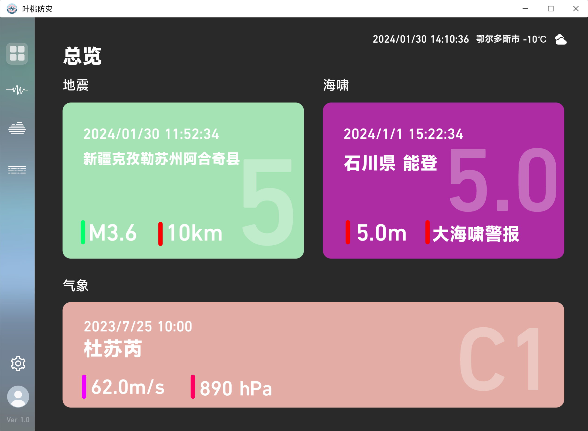
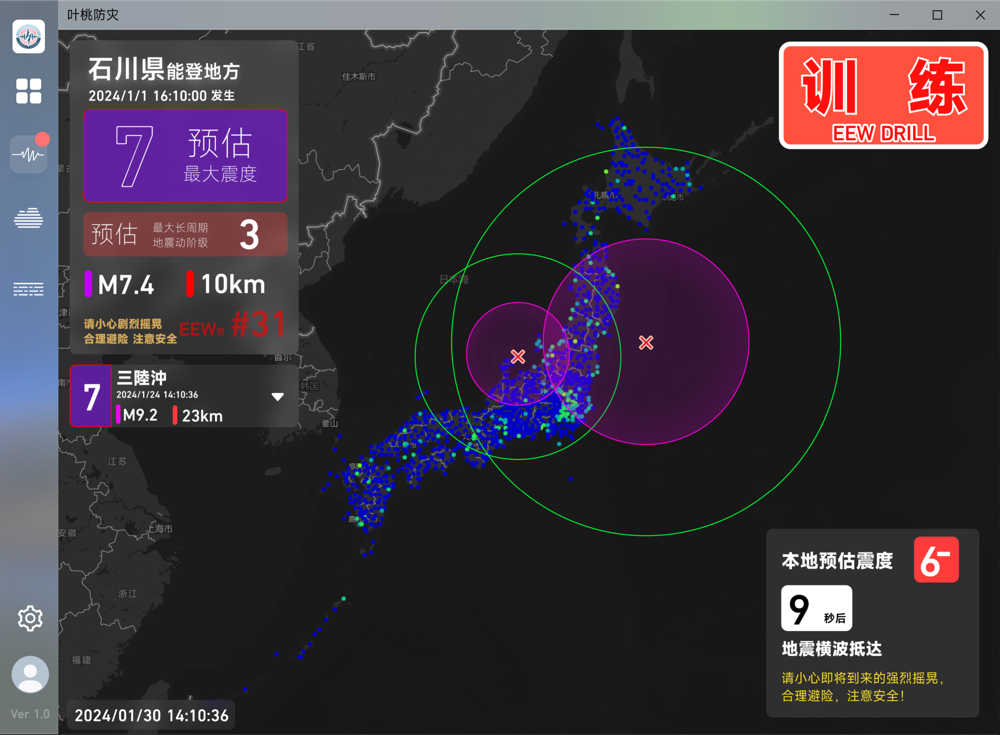

# 软件介绍

这个页面将会介绍我们提供的`软件`与`服务`。
## 叶桃防灾 <Badge type="warning" text="开发中" />  {#lpdp}

一个致力于实现防灾减灾的开源软件。

::: details 预览 

:::
::: danger 注意
请注意，目前该软件处于开发阶段，上图的设计已弃用。
:::

## 叶桃防灾 Lite v2 <Badge type="tip" text="2.0.8" /> <Badge type="danger" text="正式版" />  {#lite} 
一个致力于实现防灾减灾的轻量化软件，即原“~~QuakeCN~~”。
::: warning 注意
使用前必须给您的Windows安装[Java](https://www.java.com/zh-CN/download/)环境。
:::

::: details 预览 

:::

## 叶桃防灾24h不间断直播 <Badge type="danger" text="LIVE" /><Badge type="info" text="长期提供" />  {#live}
一个致力于实现自然(灾害)实时观测的直播服务。
::: danger 观看前声明
若您选择观看我们的直播，则代表您已接受我们的`权利声明＆免责声明`。
:::
::: warning 注意事项
- 由于B站服务器限制，可能会存在`延迟3-7s`。
- Swarm下方时间为准确校时的UTC时间，换算为CST时间(中国标准时间)需`+8小时`。
- Swarm所展示的波形中可能存在测站周围的环境噪声，请注意辨别`(地震震动主要分布在低频频域)`。
- 由于叶桃防灾推流服务器网络环境限制，左侧观测软件可能偶尔出现`停顿`，`延迟`的状况。
- 使用我们的官方账号[叶桃防灾](https://space.bilibili.com/1297775055)下投稿/发表的内容作为素材时请`标注来源`及`作者`。
:::
::: details 基本信息
- 直播间包含JQuake，~~CEIV 2~~等观测软件以及Raspberry Shake设备提供的地震观测数据。
- RS测站统一命名: `AM.RD3C0(.00.EHZ)`
- 推流地点：内蒙古自治区 鄂尔多斯市 (39.6°N, 109.7°E)
:::

::: details 界面布局
- 左上角：~~_CEIV2(中国CENC地震信息+四川地震局地震预警)_~~
- 左下角：JQuake(使用dmdss API，日本NIED观测点监测+JMA EEW+JMA 地震情报+JMA 海啸情报)
- 右侧：Swarm 3.2.0(RS波形监测以及频谱图 - 前者带通0.1-10Hz滤波/后者低通0-15Hz滤波)
:::

## 叶桃防灾地震观测网络`LEPO` `LP-Net` <Badge type="warning" text="开发中" /> <Badge type="danger" text="内部测试" />  {#lepo}
一个为爱好而生的低成本地震观测设备。
::: info 信息
正在开发与内测中，后续信息请关注我们。
:::

## 叶桃防灾自然灾害信息推送服务 <Badge type="info" text="BOT" /> <Badge type="danger" text="正式使用" /> <Badge type="info" text="长期提供" />   {#indmsg}
一个即时性的自然灾害信息推送服务(机器人)。
::: details 内容
包含ICL，中国四川地震局，JMA，CMA等服务推送。
:::